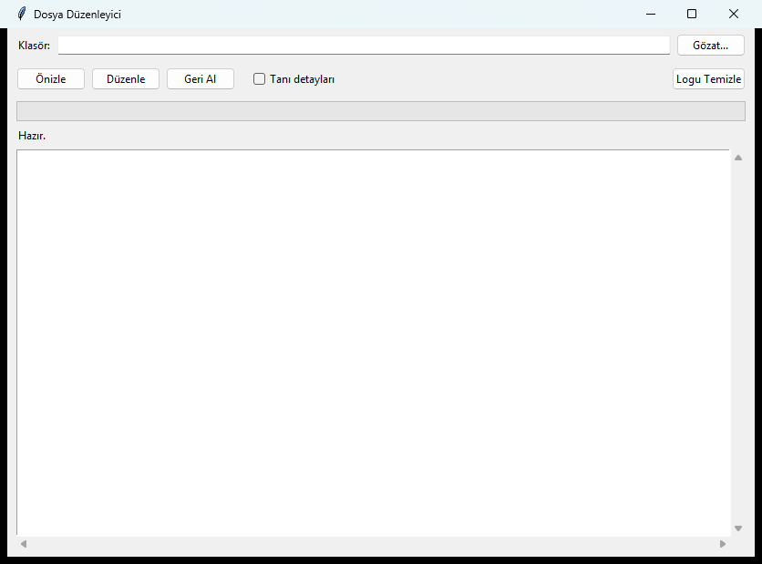
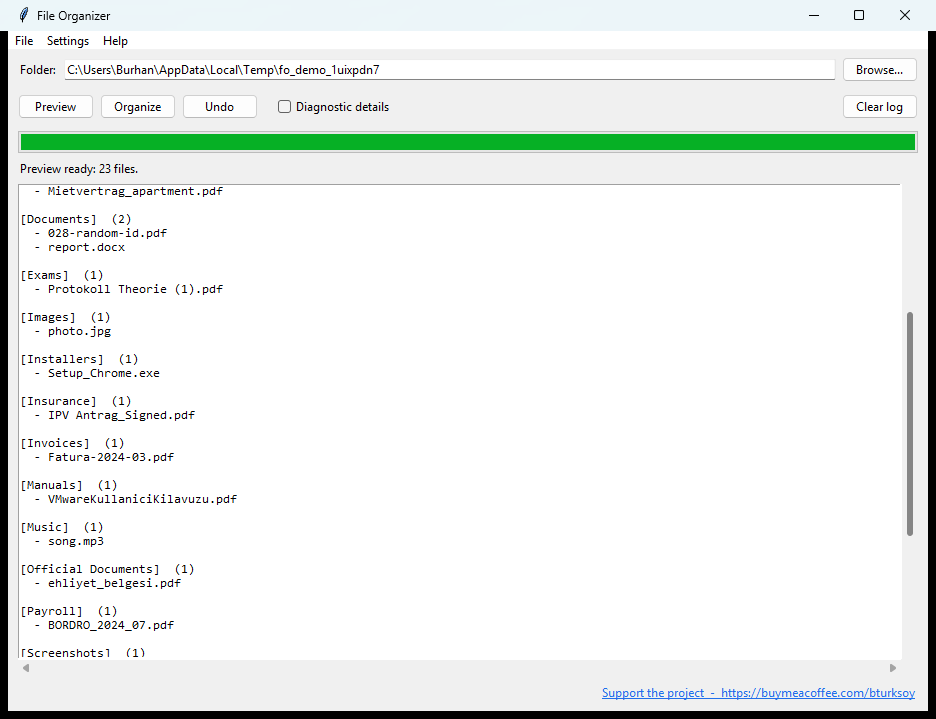

# Auto File Organizer

A standalone Windows utility that scans a folder and automatically sorts files
into category subfolders. Built specifically to tame messy Downloads folders.

No installation, no setup, no dependencies — just one `.exe`.



## Highlights

- **Single-file `.exe`** — download and run. No installer, no Python, no admin rights.
- **Three-layer classification**
  - Filename pattern matching across **20+ categories**
  - **PDF/DOCX content inspection** — detects CVs even when the filename gives no hint
  - Fallback to extension-based grouping for common file types
- **Multilingual filename rules** — works on Turkish, English, and German filenames
- **Bilingual UI** — switch between English and Turkish from the Settings menu;
  preference persists across sessions
- **Auto-update on launch** — the app checks GitHub for newer releases on
  startup; when one is available a non-intrusive banner offers to install it
- **Drag and drop** — drop a folder onto the window to select it
- **Recent folders** — quick-pick from your last few organized locations
- **Right-click to reclassify** — see a file in the wrong category? Right-click
  it in the preview and pick the right one. Your override is honoured when
  you Organize.
- **Optional destination folder** — point everything at a single library
  (e.g. `E:\Library`) and all sources funnel into one organized vault
- **Background mode** — enable scheduled auto-organize and the app keeps a
  tray icon, re-running on the folder you watch at your chosen interval
- **Keyboard shortcuts** — Ctrl+P preview, Ctrl+O organize, Ctrl+Z undo, F5 refresh
- **Smart Turkish handling** — folds dotless `ı → i`, strips combining marks
  (so `Kılavuz` matches `kilavuz`, `EHLİYET` matches `ehliyet`)
- **Fuzzy match for broken PDFs** — when a PDF's font has missing Unicode mappings
  (common with Canva/Figma exports) the keywords are still found via single-character
  edit-distance variants
- **Preview before you commit** — see exactly what will move where, then confirm
- **Full undo** — every operation is reversible. Logs are kept per-folder
- **Diagnostic mode** — toggle "Diagnostic details" to see *why* each file was
  classified the way it was

## Preview in action

Run **Preview** to see the categorization plan before any file is touched:



## Categories

The folder name on disk follows the active UI language. Switch between English
and Turkish from **Settings → Preferences**.

| Category (EN) | Category (TR) | Triggered by | Examples |
|---|---|---|---|
| **CV** | CV | name + PDF/DOCX content | `Jane_CV_2024.pdf`, `AcmeCV_Doe.docx`, `Resume.pdf`, content with "Curriculum Vitae" / "Özgeçmiş" / "Work Experience + Education + Skills" |
| **Invoices** | Faturalar | name | `Fatura`, `invoice`, `receipt`, `makbuz`, `bill` |
| **Payroll** | Bordro | name | `bordro`, `gehaltsabrechnung`, `turnusabrechnung`, `payslip`, `payroll` |
| **Bank** | Banka | name | `dekont`, `kontoauszug`, `payment confirmation`, `transaction details`, `account statement` |
| **Tax** | Vergi | name | `steuerberater`, `mandanteninformation`, `finanzamt`, `vergi beyanname` |
| **Telecom** | Telekom | name | `vodafone`, `turkcell`, `turk telekom`, `numara tasima` |
| **Insurance** | Sigorta | name | `sigorta`, `versicherung`, `sfr ausland`, `ipv antrag` |
| **Contracts** | Sözleşme | name | `sözleşme`, `mietvertrag`, `vertragsbestätigung`, `kündigung`, `vollmacht`, `ibraname`, `mitgliedschaft`, `ek protokol` |
| **Housing** | Konut | name | `mietspiegel`, `yapi raporu`, `tapu`, `emlak`, `nebenkostenabrechnung` |
| **Tickets** | Bilet | name | `bilet`, `ticket`, `boarding pass` (substring) |
| **Visa** | Vize | name | `visum`, `einladungsschreiben`, `antragszusammenfassung` |
| **Official Documents** | Resmi Belge | name | `dijital kimlik`, `nvi-`, `emniyet-`, `ehliyet`, `pasaport`, `mezun belgesi`, `oturum uzat`, `sicil kayd`, `e-devlet` |
| **Exams** | Sınav | name | `protokoll theorie`, `ergebnisprotokoll` |
| **Manuals** | Kılavuz | name | `kılavuz`, `user guide`, `manual`, `handbuch` |
| **Returns** | İade | name | `iade`, `refund`, `return label` |
| **Logs** | Loglar | name | `eventlog`, `errorlog`, `crashlog` |
| **Vehicles** | Araç | name | `pdf-expose-`, `piaggio`, `limousine`, `bmw_`, `mercedes_`, `audi_`, `vw_`, `renault_` |
| **Screenshots** | Ekran Görüntüleri | name | `screenshot`, `screen shot`, `ekran goruntusu`, `screencap` |
| **Installers** | Kurulum | name + ext | starts with `setup_`/`installer_` or has `.exe`/`.msi`/`.msix` |
| **Documents** | Belgeler | ext | `.pdf`, `.doc`, `.docx`, `.txt`, `.rtf`, `.odt`, `.md`, `.epub` |
| **Spreadsheets** | Tablolar | ext | `.xls`, `.xlsx`, `.csv`, `.ods` |
| **Presentations** | Sunumlar | ext | `.ppt`, `.pptx`, `.odp`, `.key` |
| **Images** | Resimler | ext | `.jpg`, `.png`, `.gif`, `.webp`, `.heic`, `.svg` |
| **Videos** | Videolar | ext | `.mp4`, `.avi`, `.mkv`, `.mov` |
| **Music** | Müzik | ext | `.mp3`, `.wav`, `.flac`, `.aac`, `.m4a` |
| **Archives** | Arşivler | ext | `.zip`, `.rar`, `.7z`, `.tar.gz` |
| **Code** | Kod | ext | `.py`, `.js`, `.ts`, `.html`, `.cpp`, `.cs`, `.gd` |
| **Fonts** | Yazı Tipleri | ext | `.ttf`, `.otf`, `.woff`, `.woff2` |
| **Disk Images** | Disk Kalıbı | ext | `.iso`, `.img`, `.dmg`, `.vhd` |
| **Torrents** | Torrent | ext | `.torrent` |
| **Other** | Diğer | fallback | anything not matched above |

## How it works

Classification is a 4-step waterfall — first match wins:

1. **CamelCase CV check** on the original filename (catches `AcmeCV_*`,
   `JohnCv_2025.pdf` and similar names that strict word-boundary rules miss)
2. **Name patterns** on the normalized filename (lowercased, NFD-decomposed,
   combining marks stripped, dotless `ı` folded to `i`)
3. **Content inspection** for `.pdf` and `.docx` — extracts text from the first
   3-4 pages, normalizes, then looks for:
   - **Strong CV signals** (1 hit ⇒ CV): `curriculum vitae`, `özgeçmiş`, `resume`, `résumé`
   - **Weak CV signals** (2+ hits ⇒ CV): `work experience`, `education`, `skills`,
     `certifications`, `references`, `languages`, `iş deneyimi`, `eğitim`,
     `yetenekler`, `sertifikalar`, `kişisel bilgiler`, `linkedin.com/in/`, etc.
   - **Fuzzy fallback** if exact matching fails: drops one internal character
     from each keyword and re-checks against whitespace-stripped text. This
     recovers CVs from PDFs where a font's glyph-to-Unicode mapping is broken
     and individual characters (often `i`) are silently dropped.
4. **Extension** lookup against the category map above.

Files that don't match anything land in `Other`. Subfolders are never touched —
only the chosen folder's top-level files. Name collisions get `(1)`, `(2)`
suffixes so nothing is ever overwritten.

## Install

1. Grab `FileOrganizer.exe` from the [latest release](../../releases/latest).
2. Double-click. There is no installer.

The file is roughly 28 MB (bundles Python 3.13, tkinter, pypdf, python-docx via
PyInstaller `--onefile`). First launch unpacks once into your temp directory
and is slightly slower than subsequent runs — this is normal.

### SmartScreen and antivirus warnings

When you first run the exe, Windows SmartScreen may show a blue dialog:

> Windows protected your PC

This is the standard warning for any unsigned executable downloaded from the
internet, especially a new one with no established reputation. The dialog
itself is **not** flagging the file as malicious — it just hasn't seen enough
downloads to mark it as known-safe.

To proceed:

1. Click **More info**
2. Click **Run anyway**

Some antivirus engines (including Windows Defender heuristics) will also
occasionally flag PyInstaller-packaged executables. This is a well-known
[false-positive pattern](https://github.com/pyinstaller/pyinstaller/issues/5854)
that affects most Python apps packaged this way: the bootloader extracts
files to a temporary directory at runtime, which heuristically resembles
self-extracting malware.

### Verifying your download

Each release lists the SHA-256 hash of the published `FileOrganizer.exe`.
Verify your downloaded copy in PowerShell:

```powershell
Get-FileHash FileOrganizer.exe -Algorithm SHA256
```

Compare the printed hash to the one in the release notes. If they match,
the file is identical to what was uploaded.

### Reporting false positives

If your antivirus flags the file, you can submit it as a false positive:

- **Microsoft Defender:** https://www.microsoft.com/wdsi/filesubmission
- **VirusTotal scan:** https://www.virustotal.com (drag the exe in)

These submissions help train the engines and reduce flags for future users.

## Use

1. Click **Browse...** and pick a folder (e.g. your Downloads).
2. Click **Preview** to see how files will be grouped. Nothing moves yet.
   - Optionally tick **Diagnostic details** to see *why* each file was put where.
3. Click **Organize** and confirm. Files move into category subfolders inside
   the chosen folder.
4. **Undo** reverts the most recent operation. The undo history is kept in
   `.file-organizer-undo.json` in that folder.

### Settings

Open **Settings → Preferences** to control:

- **Language** — English / Türkçe (UI + folder names follow your choice)
- **Check for updates on startup** — toggle the auto-update probe
- **Destination folder** — when set, all categorized files are moved to
  this single location instead of staying in the source folder. Categories
  become subfolders here. Leave empty to keep the in-place behaviour.
- **Background mode**
  - Enable scheduled auto-organize
  - Pick the folder to watch (e.g. your `Downloads`)
  - Set the interval (minutes between passes)
  - Start in tray when launched — useful for a "set and forget" workflow

Choices are saved to `%APPDATA%\FileOrganizer\settings.json` and reused
next launch.

### Tray and background mode

When background mode is enabled the app stops quitting on window close —
it tucks into the system tray instead. Right-click the tray icon for:

- **Show window**
- **Organize now** — trigger an immediate pass
- **Pause / Resume auto-organize**
- **Quit**

Each scheduled pass shows a Windows notification when files were moved.

### Reclassifying files

After running Preview, **right-click any file row** in the log to reassign
it to a different category. The override sticks for the upcoming Organize.
Switching folders or re-running Preview resets overrides.

### Updates

The app pings GitHub once at launch to see whether a newer release is
available. If one is, a yellow banner appears at the top of the window with
**Install** and **Dismiss** buttons. Installing downloads the new exe to a
temp file, swaps it in place via a small helper script, and relaunches.

You can also trigger a manual check anytime via **Help → Check for updates**,
and disable the automatic check from Preferences.

## Safety notes

- The app only touches files at the **top level** of the chosen folder.
  Existing subfolders (including category folders the app created previously
  in *either* language) are ignored.
- Files are **moved**, not copied. Use Undo to put them back.
- Conflicts get a `(1)`, `(2)`, ... suffix — nothing is overwritten.
- Scanned PDFs and image-only PDFs have no extractable text, so CV detection
  by content cannot work on them. Their filename signal is still used. To
  force one into the `CV` folder, rename it to include `_cv_` or move it
  manually.
- Encrypted PDFs are silently skipped (treated by extension only).
- Switching the UI language between organize runs creates English and Turkish
  category folders side by side. Run **Undo** first if you want a clean switch.

## Build from source

Prerequisites: Python 3.10+ on Windows.

```powershell
git clone https://github.com/bturksoy/auto-file-organizer.git
cd auto-file-organizer
.\build.ps1
```

Output: `dist\FileOrganizer.exe`

## Contributing translations

Translations and rule data live as plain JSON files under
[`resources/`](resources/) — no Python required to contribute.

- **`resources/i18n/<code>.json`** — UI strings + category folder names per
  language. To add a language, copy `en.json` to `<code>.json`, translate
  the values, and the app picks it up at next launch. See
  [resources/i18n/README.md](resources/i18n/README.md) for the format and
  placeholder list.
- **`resources/data/cv_keywords.json`** — strong/weak keyword lists used
  for PDF/DOCX CV detection. Add new languages or vocabulary here.
- **`resources/data/extensions.json`** — extension-to-category mapping.
- **`resources/data/skip_names.json`** — filenames the scanner ignores.

These files get bundled into the exe at build time; for end users they
become read-only resources inside the `.exe`. Contributors edit them in
the repo and submit a PR.

## Stack

- **Python 3.13** with **tkinter** for the UI (no extra GUI framework)
- **pypdf** for PDF text extraction
- **python-docx** for Word document parsing
- **PyInstaller** to produce the single-file `.exe`

The entire app is a single `organizer.py` source file.

## Support

If this tool saves you time and you'd like to say thanks:

[](https://buymeacoffee.com/bturksoy)

## License

MIT — see [LICENSE](LICENSE).
