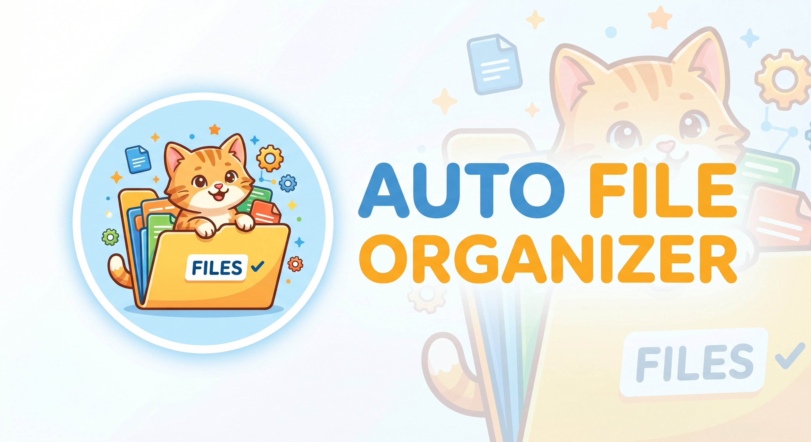
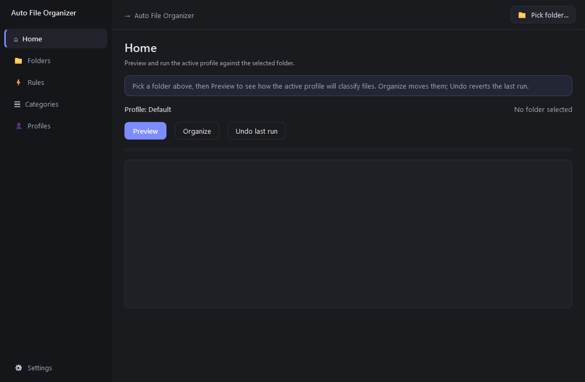
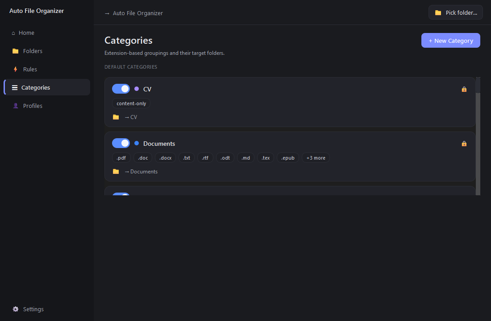
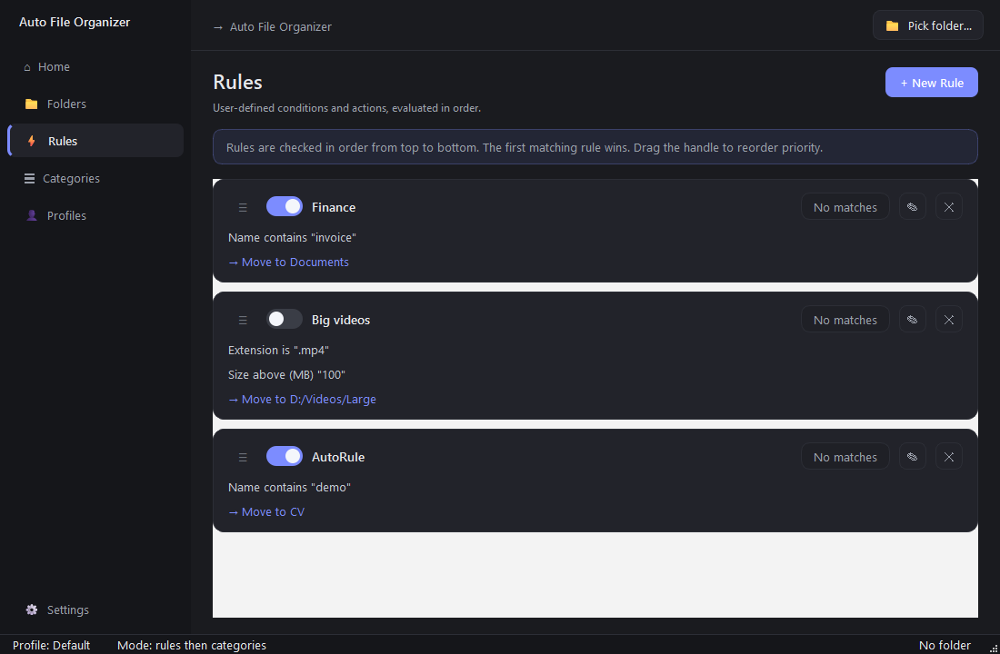
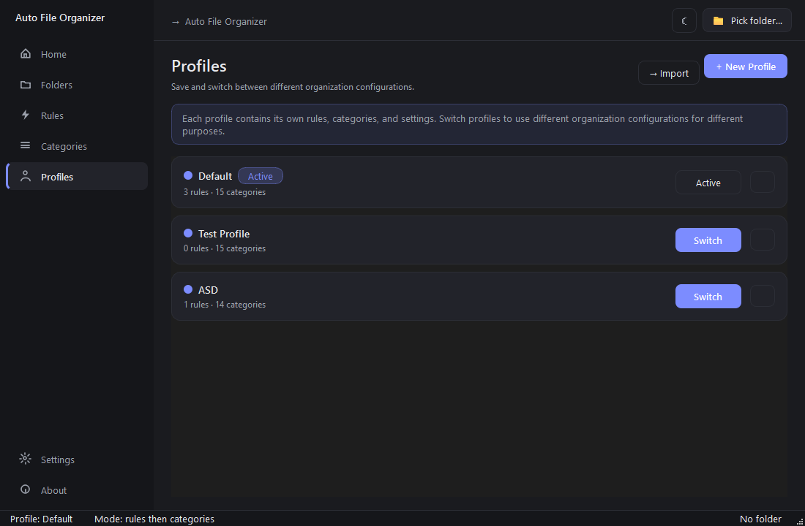
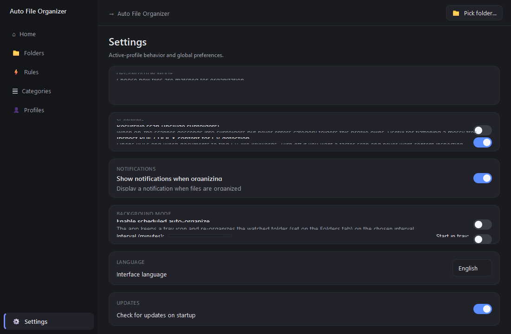

<p align="center">
  
</p>

<p align="center">
  <strong>A standalone Windows desktop app that organizes folders into category subfolders.</strong><br>
  Rules, categories, and profiles are all editable from the UI — no JSON wrangling required.
</p>

<p align="center">
  <a href="../../releases/latest">
    
  </a>
  
  
</p>

---

## Overview



## Why

The defaults handle the obvious cases: documents go to `Documents`,
images to `Images`, code to `Code`. But every folder is messy in its own
way. v2 makes that fixable from the UI:

- A rules engine for the cases your filename patterns demand.
- Editable categories so the "Documents" folder you actually want is
  whatever you call it.
- Profiles to keep "Downloads" and "Work" wired differently.
- A destination folder so every source folder can feed one organized
  library on another drive.
- Background mode with a system-tray icon for hands-off cleanup.

## Screenshots

| | |
|---|---|
| **Categories** — toggle, recolor, edit extensions, set target folders. | **Rules** — chain conditions and pick where matched files go. |
|  |  |
| **Profiles** — switch whole configurations. Import/export as JSON. | **Settings** — language, organization mode, scheduler, updates. |
|  |  |

## Install

1. Grab `FileOrganizer.exe` from the [latest release](../../releases/latest).
2. Double-click. There is no installer.

The file is roughly 54 MB (PySide6 bundle). First launch unpacks to
`%TEMP%\_MEI*` and is briefly slower than subsequent runs — this is
normal for PyInstaller `--onefile`.

### SmartScreen and antivirus

Windows SmartScreen may show "Windows protected your PC" on first run.
Click **More info → Run anyway**. This is the standard warning for any
unsigned executable. To verify the file is untouched:

```powershell
Get-FileHash FileOrganizer.exe -Algorithm SHA256
```

Compare to the hash in the release notes.

## Use

1. Pick a folder from the top-right picker. (Or set a destination folder
   in **Folders** so every source funnels to one place.)
2. Switch to **Home** and click **Preview**. Nothing moves; you'll see
   how the active profile groups your files.
3. Click **Organize** to actually move them.
4. **Undo last run** reverses the most recent operation. The history is
   stored in `.file-organizer-undo.json` inside the folder.

### Rules

`Rules` lets you define conditions (`name contains`, `extension is`,
`size above MB`, `regex`, …) and an action (move to a category, move to
a folder, skip). Rules are evaluated top-to-bottom and the first match
wins — drag the ≡ handle to reorder priority.

### Categories

`Categories` shows extension-based groupings. The default profile seeds
common buckets (Documents, Images, Music, Code, …) plus a content-aware
**CV** bucket that detects résumés inside PDF/DOCX even when the filename
doesn't say so. Each category has a color, a list of extensions, and a
target folder name. Built-in categories are locked; custom ones can be
edited or deleted.

### Profiles

A profile bundles a set of rules, categories, and behavior settings.
Have "Downloads" with broad heuristics and "Work" with specific
client-folder rules — switch between them from the **Profiles** tab.
Profiles can be exported to JSON and shared.

### Background mode

In **Settings → Background mode**, enable scheduled auto-organize, pick
an interval, and the app keeps a tray icon. The tray menu has
**Show window / Organize now / Pause / Quit**, and a Windows
notification fires after each pass that actually moved files.

## How classification works

Each profile picks one of three **organization modes**:

| Mode | What it does |
|---|---|
| **Rules first, then categories** *(default)* | Rules run first; unmatched files fall through to extension-based categories; remaining `.pdf`/`.docx` files get a CV content check; anything else goes to `Other`. |
| **Categories only** | Skip rules entirely. Pure extension-based sorting. |
| **Rules only** | Only files matched by a rule are moved. Everything else stays put. |

The CV content check looks for strong signals (`curriculum vitae`,
`özgeçmiş`, `resume`) or any two weak signals (`work experience`,
`education`, `skills`, …) in the first few pages of a PDF or DOCX, with
fuzzy fallback for fonts whose Unicode mappings are broken.

## Languages

UI strings and category folder names are defined in
`resources/i18n/<code>.json`. Switch language from
**Settings → Language**. Adding a new language is a copy-and-edit:

1. Copy `resources/i18n/en.json` to `<code>.json`.
2. Update `_meta.code` and `_meta.name`.
3. Translate `strings` and `categories` values (keep the keys).
4. Restart — the new language appears in the picker automatically.

See [resources/i18n/README.md](resources/i18n/README.md) for the full
contributor guide.

## Build from source

Prerequisites: Python 3.10+ on Windows.

```powershell
git clone https://github.com/bturksoy/auto-file-organizer.git
cd auto-file-organizer
.\build.ps1
```

Output: `dist\FileOrganizer.exe`. The script also prints the SHA-256.

To run from source without packaging:

```powershell
py -m pip install -r requirements.txt
py -m app
```

## Stack

- **Python 3.13** with **PySide6 6.11** for the UI
- **pypdf** for PDF text extraction
- **python-docx** for Word documents
- **truststore** + **certifi** for HTTPS with corporate certs
- **PyInstaller** to produce the single-file `.exe`

Sources live under [`app/`](app); user-editable data under
[`resources/`](resources); persisted preferences and profiles under
`%APPDATA%\FileOrganizer\appdata.json`.

## Support

If this saves you time and you'd like to say thanks:

[](https://buymeacoffee.com/bturksoy)

## License

This project is licensed under the **GNU General Public License v3.0** —
see [LICENSE](LICENSE) for the full text.

In short: you are free to use, study, modify, and redistribute the
software, but any distributed modifications must also be released under
the GPLv3 and ship their source.
